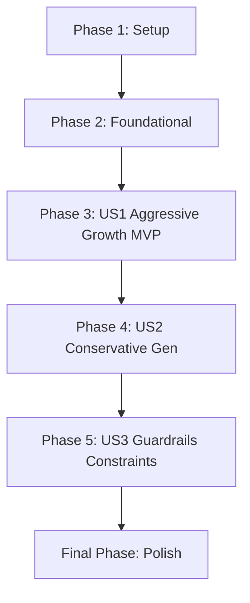

# Implementation Tasks: AI Investment Portfolio Agent

**Feature**: `001-react-investment` 
**Spec**: [spec.md](./spec.md) | **Plan**: [plan.md](./plan.md) | **Models**: [data-model.md](./data-model.md)

## Implementation Strategy

We will build the console AI agent incrementally:
1. **MVP (Phase 3)**: Establish the core models, mock the LLM tools, and prove the CLI loop runs.
2. **Phase 4**: Handle the strict bond/cash generation logic for conservative inputs.
3. **Phase 5**: Complete edge-case handling for conflicting goals.

---

## Phase 1: Setup

*Goal: Initialize the standalone Python project and dependencies.*

- [ ] T001 Initialize Python project structure (`src/`, `tests/`)
- [ ] T002 Create `requirements.txt` with `langchain`, `pydantic`, `pytest`, `ollama`
- [ ] T003 Set up `.env.example` file

---

## Phase 2: Foundational

*Goal: Blockers and prerequisites required by all user stories. Core schemas and the LLM connection.*

- [ ] T010 Create `InvestorProfile` Pydantic model in `src/models/profile.py`
- [ ] T011 Create `AssetAllocation` and `InvestmentAsset` Pydantic models in `src/models/allocation.py`
- [ ] T012 Create `PortfolioPlan` Pydantic model in `src/models/portfolio.py`
- [ ] T013 Initialize the Langchain/Ollama LLM connection block in `src/agent.py`

---

## Phase 3: Aggressive Growth Portfolio Generation [US1] (MVP)

*Goal: Complete pipeline taking user inputs, running the ReAct reasoning loop, and outputting an aggressive equity portfolio.*

**Independent Test**: Running `python src/run.py` and answering the 4 prompts results in a JSON-backed portfolio heavy in stocks (e.g., VTI).

- [ ] T020 [US1] Build the CLI Q&A gathering loop (Term, Risk, Age, Goal) in `src/run.py`
- [ ] T021 [US1] Create the core ReAct prompt template in `src/agent.py` explicitly demanding step-by-step thinking mapping age/risk to allocation.
- [ ] T022 [US1] Implement In-Run Memory tracking using LangChain memory buffers in `src/memory.py`
- [ ] T023 [US1] Wire the CLI inputs directly to the ReAct chain in `src/run.py`
- [ ] T024 [US1] Implement structured output parsing enforcing the `PortfolioPlan` schema at the end of the thought chain.

---

## Phase 4: Capital Preservation Generation [US2]

*Goal: Ensure the ReAct loop accurately constrains equity when given a strict max drawdown (e.g., 5%).*

**Independent Test**: The agent outputs predominantly bonds and short-term treasuries when given a 60yo profile with a 5% drawdown limit.

- [ ] T030 [US2] Add mock risk mapping tool (e.g., `map_risk_to_allocation`) in `src/tools/risk.py`
- [ ] T031 [US2] Register the tool with the ReAct agent in `src/agent.py`
- [ ] T032 [US2] Update prompt to encourage tool usage for strict drawdown thresholds.

---

## Phase 5: Goal Contradiction Handling [US3]

*Goal: Agent politely flags contradictory inputs instead of hallucinating.*

**Independent Test**: Inputting "100% growth" but "0% drawdown" yields a reasoning step that stops and asks the user to revise their inputs.

- [ ] T040 [US3] Implement Input Guardrails pre-validation inside `src/models/profile.py` checking for obvious logical flaws before LLM execution.
- [ ] T041 [US3] Update `src/run.py` to handle guardrail exceptions by prompting the user to re-enter parameters (Human-in-the-Loop).

---

## Final Phase: Polish & Cross-Cutting

*Goal: Validation, testing, and documentation.*

- [ ] T090 [P] Write unit tests for Pydantic models in `tests/unit/test_models.py`
- [ ] T091 [P] Write unit tests for Input Guardrails in `tests/unit/test_guardrails.py`
- [ ] T092 Ensure `README.md` reflects the `quickstart.md` documentation.

---

## Dependencies Execution Graph

### Parallel Execution Targets
- `T010`, `T011`, `T012` can be built simultaneously in Phase 2.
- `T090`, `T091` can be tackled simultaneously in the Final Phase.
